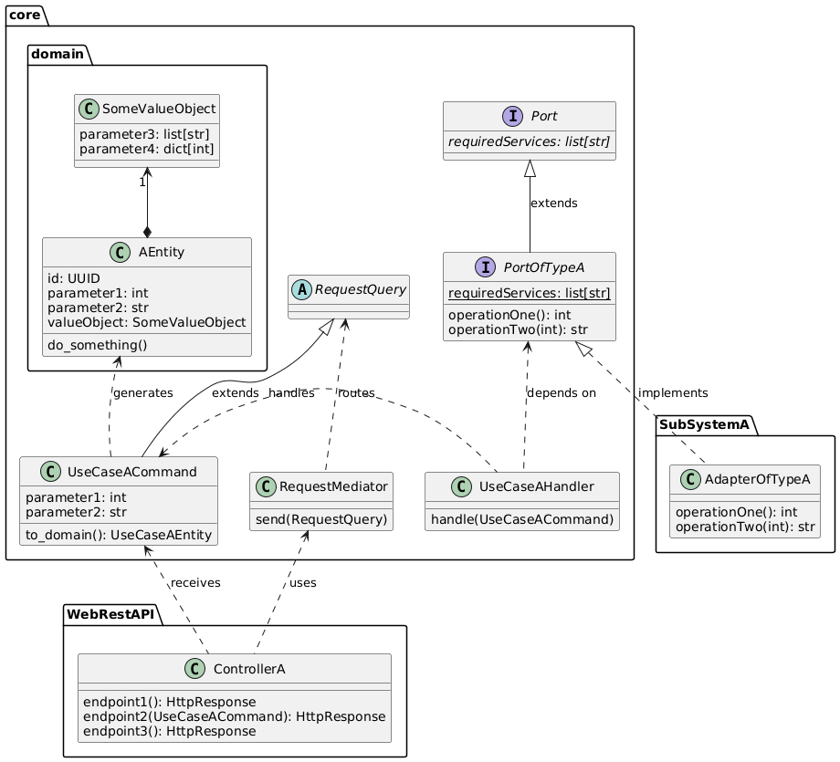

# Backend - SIEE

Este directorio compila todos los paquetes de backend para el proyecto SIEE.
Todos ellos son paquetes de Python interdependientes entre sí: algunos (aquellos con un `Dockerfile`) son servicios, los demás son librerías que proveen adaptadores.
El resto son únicamente librerías que proveen la lógica que hace funcionar a los servicios.
Notablemente, el paquete `core` contiene la lógica central de la aplicación, manteniendo las reglas de negocio y orquestando los demás componentes lógicos.
Esta librería (y otras más, según se necesiten) se inyecta como dependencia en cada uno de los servicios, con lo que se consigue mantener la lógica de negocio consistente entre estos.

Un servicio nunca se debe comunicar de manera lógicamente directa con otro.
En vez de eso, debe realizar peticiones a la librería `core` a través de CQRS e implementar un adaptador para que otros servicios logren comunicarse con este.



## Paquetes

- [core](core): Librería central que define las interfaces y entidades del sistema.
- [docker-service-discovery](docker-service-discovery): Adaptador de descubrimiento de servicios para Docker.
- [dragonfly-realtime-storage](dragonfly-realtime-storage): Adaptador de almacenamiento en tiempo real usando Redis/DragonflyDB.
- [coordinator](coordinator): Servicio que busca coordinar a operadores, paramédicos y ciudadanos para el manejo rápido de emergencias.

## Ejecutar

La manera más óptima de ejecutar todo el Backend es a través de docker compose:

```sh
docker compose up
```

Esto se encargará de construir y ejecutar todos los servicios requeridos al mismo tiempo, asegurándose que sean visibles entre ellos.
Ejecutar todo servicio por servicio va a causar problemas con el descubrimiento entre ellos, vea las [Notas] para más información.

## Documentación

La documentación de cada uno de los paquetes se genera con [mkdoc](https://realpython.com/python-project-documentation-with-mkdocs/).
Puedes ver la documentación de un paquete con:

```sh
poetry run mkdocs serve
```

El cual comenzará a servir la documentación en el puerto especificado.


## Escribiendo un nuevo paquete

En primer lugar, es importante tener clara la diferencia entre un Adaptador y un Servicio.

Un **Servicio** es un programa físico que hace algo dentro de la aplicación. Por ejemplo, un servicio para proveer una API REST para el sistema.

En cambio, un **Adaptador** tiene el propósito de describir cómo la aplicación puede realizar un conjunto de acciones específicos, implementando una interfaz definida en `core`, llamada **Puerto**.
Un **Puerto** define de manera inequívoca lo que se espera que un **adaptador** haga, independientemente de la tecnología que utilice para esto.

Como se observa, un **Adaptador** es un componente lógico: existe en la forma de una clase escrita en el código de la aplicación, mientras que un **Servicio** es un componente físico: existe en la capa de la infraestructura de la aplciación.

Revisemos algunos paquetes existentes a la luz de estos dos conceptos:
- [coordinator](coordinator) es un paquete que define un servicio: una interfaz de endpoints HTTP y WebSockets al sistema. Además, también define un adaptador con el propósito de notificar los cambios del sistema a los actores que este servicio coordina.
- [dragonfly-realtime-storage](dragonfly-realtime-storage) es un paquete que define un adaptador, que a su vez requiere de un **servicio** para funcionar: una base de datos dragonflyDb. Este adaptador implementa el puerto de almacenamiento en tiempo real utilizando lógica propia de dragonflyDb.

Teniendo esta diferencia conceptual clara, se describirá a grandes rasgos cómo se escribe un paquete, que puede implicar escribir un adaptador, un servicio o ambos.

### Inicializando el paquete

En primer lugar, crea la carpeta en donde vas a alojar el código de tu paquete:
```sh
mkdir paquete-ejemplo
```

**Convenciones de nombre:** usa siempre minúsculas separadas por guiones medios (`-`).

Luego, inicializa el paquete:

```sh
cd paquete-ejemplo # cambiar de dierectorio
poetry init # inicialización interactiva del paquete, leer instrucciones siguientes
```

Este último comando preguntará por varias cosas para construir el archivo `pyproject.toml` del paquete. La mayoría de ajustes son autoexplicativos, pero se debe tener en cuenta lo siguiente:

- Colocar un nombre de paquete sin guiones medios (`-`), sólo guiones bajos (`_`). No necesariamente tiene que ser el resultado de una sustitución directa sobre el nombre de carpeta escogido (e.g. el paquete en `paquete-ejemplo` no necesariamente tiene que llamarse `paquete_ejemplo`), pero por favor utiliza un nombre significativo para lo que sea que vayas a escribir.
- No escojas dependencias de manera interactiva, eso lo haremos en un momento.

Poetry te pedirá confirmación antes de escribir un `pyproject.toml`. Cuando le digas que sí, creará este archivo de acuerdo a los ajustes escogido.

### Las dependencias

Seguramente tendrás dependencias externas que quieras utilizar para tu paquete.
Antes de que comiences a definirlas, es importante añadir la siguiente línea en la sección `[project]` de tu `pyproject.toml`:

```toml
[project]
# ....
dynamic = ["dependencies"]
# ....
```

Esto permitirá que las dependencias se escriban no de acuerdo a [PEP508](https://peps.python.org/pep-0508/), sino con el formato interno de poetry.
Esto es importante cuando definas las dependencias **internas** de tu paquete, ya que PEP508 no soporta localizaciones de archivo relativas.
Con ello puedes escribir dependencias externas de la siguiente manera:

```sh
poetry add nombre-dependencia
```

Y dependencias internas con:

```sh
poetry add ../nombre-carpeta
```

Siendo `nombre-carpeta` el nombre de una carpeta en este directorio, por supuesto.
La primera dependencia interna que querrás definir va a ser `core`:

```sh
poetry add ../core
```

### Carpetas y archivos

Debes de crear la carpeta `src/nombre_paquete` y el archivo `README.md` para que poetry pueda reconocer tu carpeta como un paquete:

```sh
mkdir -p src/nombre_paquete # Crear carpeta de código fuente
echo '# Título del paquete' > README.md # Escribir título en el README.md
touch src/nombre_paquete/__init__.py # Crear el archivo __init__.py
```

Adicionalmente, se recomienda crear el archivo `src/nombre_paquete/__init__.py` que importe los objetos que se quieran exponer de manera externa, como Adaptadores.

### El código

En general, tiene total libertad de organizar tu código como quieras, siempre y cuando sigas el estilo definido en [PEP8](https://peps.python.org/pep-0008/), con algunas consideraciones. En resumen:

- Siempre utiliza inglés.
- 4 espacios por nivel de indentación.
- Idealmente, no más de 79 caracteres por línea.
- `PascalCase` para nombres de clases.
- `camelCase` para atributos, variables y parámetros (sí, esto es un estándar específico para este proyecto).
- `snake_case` para funciones.
- `MAYUSCULAS_EN_SNAKE_CASE` para constantes.
- `_prefijos_con_guion_bajo` para elementos privados al contexto (e.g. atributos o métodos privados dentro de una clase, constantes o variables internas en módulos, etc.). El ejemplo indicaría aplicaría para funciones, pero en realidad deberías utilizar el casing que más haga sentido para el elemento en cuestión.

**En cuanto a organización del código en sí:** si defines un adaptador, su clase debe estar disponible directamente debajo del paquete, para permitir importarlo de la siguiente manera:

```python
# Código externo al paquete
from nombre_paquete import AdaptadorDeEjemplo
```

Esto significa que debes definir un archivo `__init__.py` donde traigas el adaptador y lo hagas visible para los usuarios externos del paquete.
Esto lo conseguirías, asumiendo que tu adaptador se define en `main.py`:

```python
# __init__.py

from .main import AdaptadorDeEjemplo
```

A continuación se detallan aspectos más específicos respecto al uso de la librería `core`.

### ¿Siempre tengo que definir un adaptador?

Debes definir un adaptador si necesitas que tu código reaccione a estímulos externos del sistema:
Ejemplos:

- Se creó una emergencia nueva, quieres notificar de su existencia a ciertos actores.
- Se creó una emergencia nueva, quieres guardarla a una base de datos.
- Un usuario solicitó un reporte, quieres buscarlo en el sistema de archivos.

No obstante, la arquitectura no está pensada para que te suscribas a eventos de manera arbitraria por fuera de `core`.
Sino, `core` es quien responde a los eventos directamente a través de CQRS.
En esta respuesta, sin embargo, necesitará posiblemente comunicarse con servicios externos.
`core` no sabe cómo comunicarse con servicios externos o tecnologías específicas, y para eso necesita de un **adaptador**, como el que posiblemente vas a escribir.
Ahora bien, `core` espera poder realizar ciertas operaciones con estos adaptadores.
El conjunto de operaciones que `core` espera de un tipo de adaptador específico es lo que se denomina como un **puerto**, y sirven como puntos de conexión entre `core` y el mundo externo.
En efecto, lo que estás haciendo cada vez que escribes un adaptador es implementar una interfaz.

Ahora bien, si lo que vas a escribir no hace parte de la respuesta de un estímulo por parte del sistema, sino que por el contrario genera estos estímulos, lo que necesitas es enviar comandos y queries a core mediante CQRS.
Una API Rest sencilla es un ejemplo de un paquete (que define un servicio) que no necesitaría definir un adaptador, sólo utilizar CQRS, y ejecutar los comandos y queries necesarios para cumplir con las peticiones que recibe.
Un adaptador de almacenamiento a una base de datos, por otra parte, es un ejemplo que sólo necesitaría definir un adaptador que sirva de puente entre `core` y la base de datos en cuestión para cuando se necesite recuperar información de esta, no utilizar CQRS porque la base de datos no generará ningún estímulo.

### Dependencia en servicios externos

Si estás escribiendo un adaptador, lo más probable es que este requiera de un servicio externo para funcionar (e.g. un servidor de base de datos, un servidor de almacenamiento de archivos). En tal caso, debes definirlo en el `docker-compose.yaml` dentro de la sección `services`.
En la clase del adaptador debes entonces definir el atributo `requiredServices` con una lista de strings de los servicios que necesitas para que el adaptador funcione.
Por ejemplo, si escribes en el `docker-compose.yaml`:

```yaml
services:
  servicioEjemplo:
    ports:
      - "3333:3333"
```

Debes escribir, en tu adaptador:

```python
class AdaptadorDeEjemplo(PuertoDeEjemplo): # Un adaptador siempre implementa un puerto
    requiredServices = ["servicioEjemplo"]
```

Hay un puerto específicamente diseñado para construir adaptadores concretos dado tipos de puerto, inyectando las dependencias a sus servicios de manera transparente: `ServiceDiscoveryPort`.
Ahora mismo, este se implementa en [docker-service-discovery](docker-service-discovery) leyendo precisamente el `docker-compose.yaml` y extrayendo el nombre del contenedor y el puerto por el cual publica su servicio.
No hace todo de manera automática, sin embargo. Necesita que hagas tres cosas para registrar tu adaptador y que otras partes del código puedan utilizarlas:

1. Registra el adaptador en `docker-service-discovery/src/docker_discovery/adapter-mappings.yaml`, añadiendo una sección como la siguiente:

```yaml
"PuertoDeEjemplo":
  - adapter: "AdaptadorDeEjemplo"
    services:
      - "servicioEjemplo"
```

Esto permitirá saber que `AdaptadorDeEjemplo` implementa el puerto `PuertoDeEjemplo` y requiere del servicio `servicioEjemplo`.

2. Añade la dependencia de tu paquete en `docker-service-discovery`. Para ello, ejecuta, en `docker-service-discovery`:

```sh
# En docker-service-discovery
poetry add ../paquete-ejemplo
```

3. Importa tu adaptador dentro del módulo `docker_discovery.discovery`:

```python
# En docker-service-discovery/src/docker_discovery/discovery.py
from paquetete_ejemplo import AdaptadorDeEjemplo
```

Se hace match del nombre del adaptador escrito en `adapter-mappings.yaml` con las variables globales de este módulo, por lo que estos tres pasos deberían permitir a cualquier usuario del `docker-service-discovery` descubrir a tu servicio.

### Usando CQRS

Vas a querer utilizar el sistema CQRS cuando tu paquete va a enviar estímulos a `core`.
Para ello tendrás que construir un mediador que enrute los comandos y queries a sus respectivos handlers.
Afortunadamente, este proceso está simplificado a través de la función `core.factories.create_mediator`, para usarla, necesitas tres cosas:
1. Un adaptador que implemente `ServiceDiscoveryPort`. Deberías utilizar `docker_discovery` para ello, añadiéndo la carpeta `docker-service-discovery` como dependencia con poetry.
2. Una lista de casos de uso (comands y queries) que esperas enviarle a `core`. Estos deberían heredar de `DefaultHandler` para especificar cuál es el handler por defecto que tengan.
3. (opcional) Si defines un adaptador, deberías pasarlo en el parámetro `adapter`. Este será utilizado siempre que los casos de uso lo requieran.

La función retorna un mediador ya listo para recibir comandos y queries mediante el método `send`.

## Notas
- El descubrimiento de servicios implementado por `docker-service-discovery` es estático: depende del `docker-compose.yaml` para resolver los servicios con los nombres de host que docker provee. En un contexto real, sería ideal implementar este descubrimiento a través de [Kubernetes](https://kubernetes.io)
