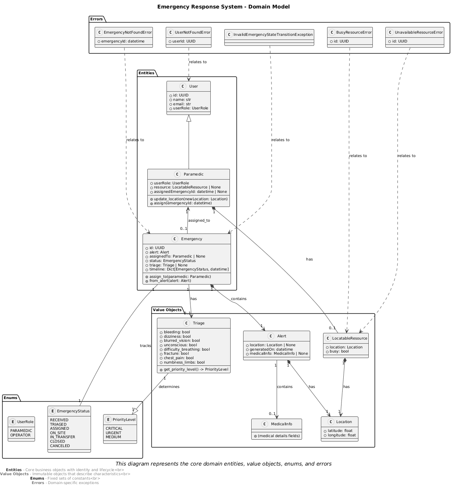

# The domain layer

The domain layer of the application is concerned with mantaining clear business rules across all the services. It operates directly with domain objects, categorized as:

1. **Entities:** That have an identity and lifecycle in the application.
2. **Value Objects:** That lack identity, and serve only as containers of data.

An overview of what is currently defined on this layer is provided by this diagram:

## Entities

::: core.domain.entities.emergency

---

::: core.domain.entities.user

---

## Value Objects

::: core.domain.value_objects.alert

---

::: core.domain.value_objects.location

---

::: core.domain.value_objects.medical_info

---

::: core.domain.value_objects.resource

---

::: core.domain.value_objects.triage
